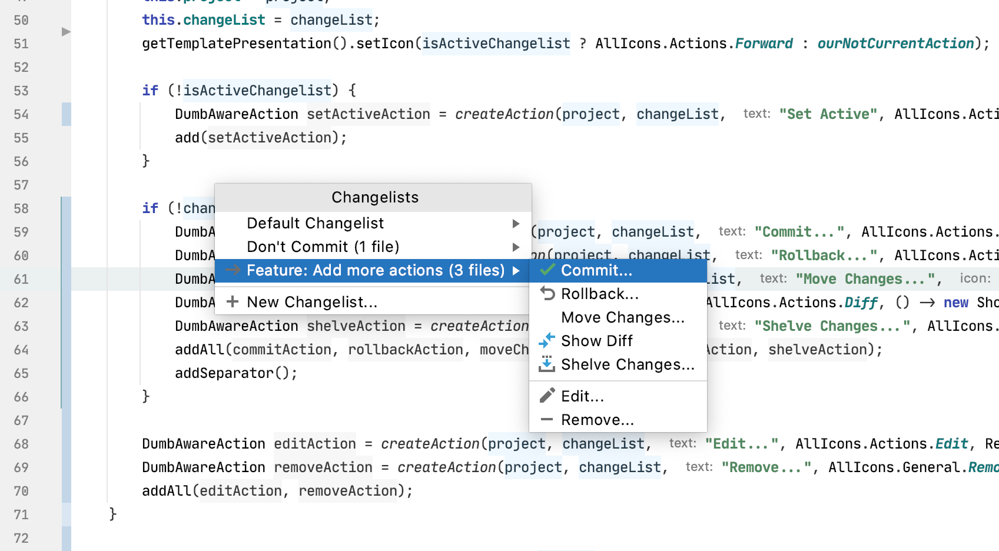

# Changelist Popup
IntelliJ Platform plugin to quickly switch, edit and remove version control changelists via keyboard shortcut and popup

## Usage
Activate via the default keyboard shortcut `control + alt + F3` (Mac: `command + option + F3`)

## Changes
### 1.0.1
 * New Changelist option
 * Edit and remove changelists
 
### 1.0.0
 * Main change list switcher action
    
## Roadmap & Ideas
 * Settings UI
 * Show active changelist in status bar
 * Cut down long changelist names
 * Add num files to changelist name 
